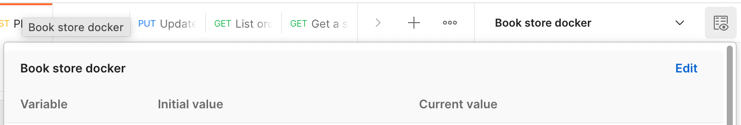

# Book store

### About

This is a solution for a HW task. See [requirements](./requirements.md) for more details.

### How to run?

1. Use docker-compose to run the project:
  ```shell
  ./mvnw clean package && docker-compose up
  ```
2. Import [postman collection](./bookstore.postman_collection.json) into the Postman app and run requests.
First, run all requests from the `admin` folder, than run the request from the `user` folder.
KEEP in mind to setup the env variable `port` to `6868`:


